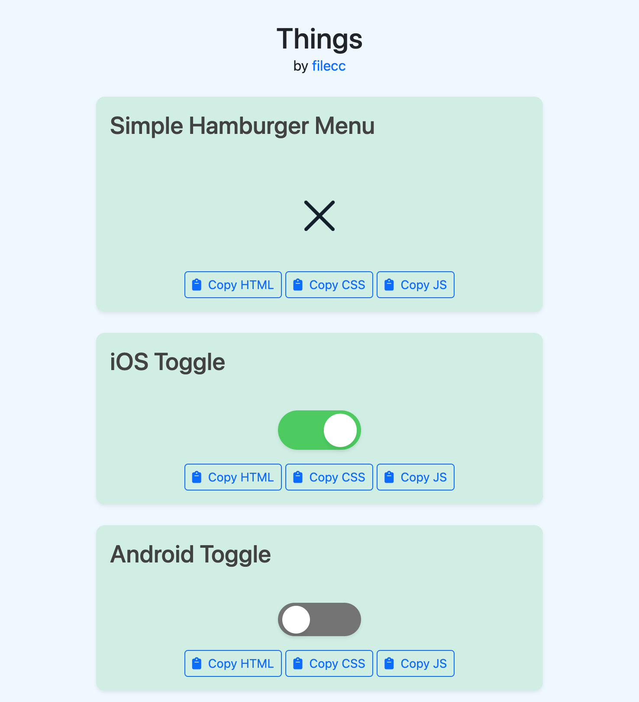

# Things by filecc

### What you can find

- Things, as the title says. Toggles, Hamburgers... etc, all crafted by me with one thing in mind: simplicity. You will not find here all that ninja code you used to find all around the web. 

### How to

- Just hit the buttons: one for HTML, one for CSS and one for JS.
- The page is accessible from https://filecc.github.io/things/ 

### Built with

- [Bootstrap](https://tailwindcss.com/) - CSS framework for the page layout
- Vanilla JS
- CSS 3
- HTML 5

## Author

- Website - [filecc](https://www.filecc.dev)
- Instagram - [Instagram](https://www.instagram.com/filecc)
- Frontend Mentor - [@filecc](https://www.frontendmentor.io/profile/filecc)
- Twitter - [@_filecc](https://www.twitter.com/_filecc)

Enjoy!
Bye 🥰🌈
